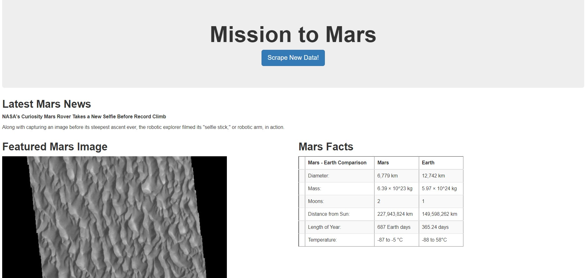

# Web Scraping Challenge - Mission to Mars
Build a web application that scrapes various websites for data related to the Mission to Mars and displays the information in a single HTML page
## Project structure
```
project  
|__ images/                     # contains images of final webpage 
|
|__ Missions_to_Mars/                    # contains app.py and scraping files
|          |_ templates/        # contains html and css files
|
|
|__ .gitignore                  # gitignore file      
|
|__ README.md                   # Readme file
```
## Install Modules and Libraries
```
pip install beautifulsoup4
pip install pymongo
pip install flask
pip install splinter
``` 
```
from splinter import Browser
from bs4 import BeautifulSoup
from selenium import webdriver
from webdriver_manager.chrome import ChromeDriverManager
from flask import Flask, render_template, redirect
from flask_pymongo import PyMongo
import requests
import pandas as pd
import time
```
## Connecting to a URL
```
url ='https://redplanetscience.com/'
browser.visit(url)
html = browser.html
soup = BeautifulSoup(html, 'html.parser')
```
## Step 1 - Scraping
### NASA Mars News
- URL: https://redplanetscience.com/
- Scrape the Mars News Site and collect the latest News Title and Paragraph Text.
```
news_title = soup.find_all('div', class_='content_title')[0].text
news_p = soup.find_all('div', class_='article_teaser_body')[0].text
```
### JPL Mars Space Images - Featured Image
- URL: https://spaceimages-mars.com/
- Use splinter to navigate the site and find the url for the current Featured Mars Image
```
partial_url = soup.find_all('a',class_="showimg")[0]['href']
featured_image_url = url + partial_url
```

### Mars Facts
- URL: https://galaxyfacts-mars.com/
- Use pandas to scrape the table containing facts about Mars and Earth
- Convert the table to a HTML string
```
mars_facts = pd.read_html(url)

mars_facts_html = mars_facts_df.to_html()
```

### Mars Hemispheres
- URL: https://marshemispheres.com/
- Create a dictionary containing keys title and img_url
- Use browser.click to navigate each link to find full resolution image
```
titles = soup.find_all('h3')[:-1]

title_ls = []
for title in titles:
    title_ls.append(title.text)

url_ls = []

for title in title_ls:
    url = 'https://marshemispheres.com/'
    browser.visit(url)
    browser.click_link_by_partial_text(title)
    html = browser.html
    soup = BeautifulSoup(browser.html, 'html.parser')
    image_url = soup.find_all('li')[0].a["href"]
    dictionary = {"title": title,"image_url":url + image_url}
    url_ls.append(dictionary)
```

## Step 2 - MongoDB and Flask Application
- Use MongoDB with FLASK to create a HTML page that displays all scraped information
- scrape_mars.py contains a function called scrape that will execute all scraping code above
- Create an app.py containing a /scrape route that imports scrape_mars.py and calls scrape function
- Create a template HTML file index.html that will take the mars data dictionary and display all the data
   - Style this HTML page using a style.css

